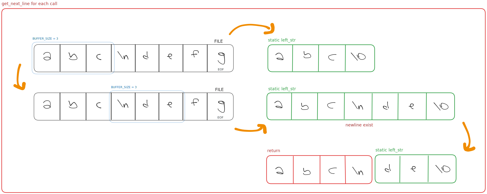

    
    <h1>get_next_line</h1>

🥱 Reading a line from a fd is way too tedious.

## About
This repository contains my solutions for the **get_next_line** project in 42.

The **get_next_line** project implements a function that reads a single line from a file descriptor, efficiently handling multiple calls to retrieve each subsequent line. It introduces the use of static variables for data persistence across calls and covers dynamic memory allocation techniques to manage variable-length input, providing a foundation in low-level programming.

## Algorithm Schema

## Contributing
Contributions are welcome! If you would like to contribute to this project, please open a pull request.